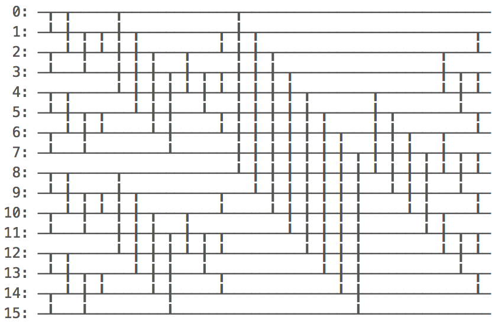

# sorting_networks

[](https://travis-ci.org/regexident/sorting_networks)
[](https://crates.io/crates/sorting_networks/)
[](https://crates.io/crates/sorting_networks/)
[](https://crates.io/crates/sorting_networks/)

## Synopsis

An implementation of [sorting networks](https://en.wikipedia.org/wiki/Sorting_network) in Rust.

## Motivation

> In computer science, comparator networks are abstract devices built up of a fixed number of "wires", carrying values, and comparator modules that connect pairs of wires, swapping the values on the wires if they are not in a desired order. Such networks are typically designed to perform sorting on fixed numbers of values, in which case they are called sorting networks. ([Wikipedia](https://en.wikipedia.org/wiki/Sorting_network))

`sorting_network` provided implementations of [Batcher's Odd-Even Merge-Sort](https://en.wikipedia.org/wiki/Batcher_odd%E2%80%93even_mergesort) for sequences of length `2`, `4`, `8`, `16`, `32`, `64`, `128` and `256`.

Example of `SortingNetwork16`:



## Usage

```rust
let mut items = vec![7, 6, 5, 4, 3, 2, 1, 0];
let network = SortingNetwork16::new();
network.sort(&mut items[..]);
assert_eq!(items, vec![0, 1, 2, 3, 4, 5, 6, 7]);
```

## Contributing

Please read [CONTRIBUTING.md](CONTRIBUTING.md) for details on our [code of conduct](https://www.rust-lang.org/conduct.html),  
and the process for submitting pull requests to us.

## License

This project is licensed under the [**MPL-2.0**](https://www.tldrlegal.com/l/mpl-2.0) – see the [LICENSE.md](LICENSE.md) file for details.
